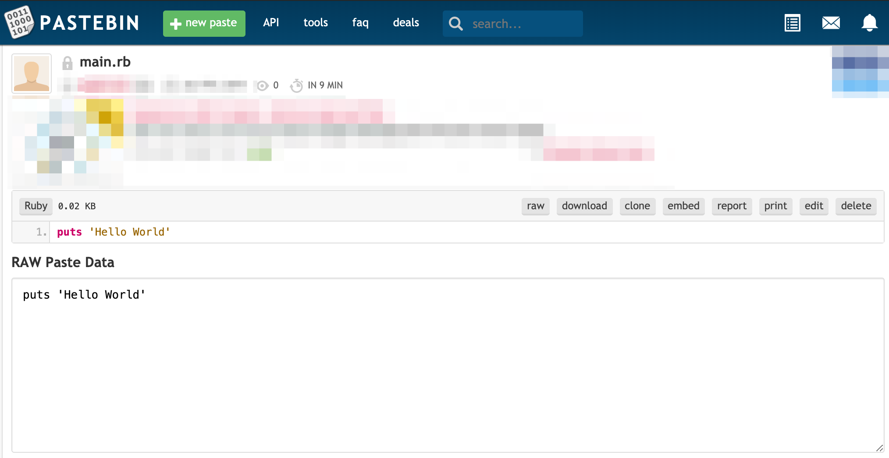

# Terraform provider for Pastebin

[](https://travis-ci.org/arminaaki/terraform-provider-pastebin)
[](https://goreportcard.com/report/github.com/arminaaki/terraform-provider-pastebin)

## Table of Content

- [Purpose](#purpose)
- [Requirements](#requirements)
- [Quickstart](#quickstart)
- [Example](#example)

## Purpose

The provider will allow you to manage
your pastes in Pastebin.

## Requirements

- [Terraform](https://www.terraform.io/downloads.html) 0.10+
- [Go](https://golang.org/doc/install) 1.12

## Quickstart

The binary artifacts are available
in [release](https://github.com/arminaaki/terraform-provider-pastebin/releases) page.
These builds are generated from the master branch.
This project uses
[go modules](https://github.com/golang/go/wiki/Modules) to manage its dependecies.

```sh
make build
```

Once the binary is successfully built,
it will be placed at `$HOME/.terraform.d/plugins` directory.

## Example

Before using the provider, ensure you have a pastebin account.
As a member of pastebin, you will be given a unique  [developer API key](https://pastebin.com/api#1).

Here is an example that will create a private paste for your provided account.

```hcl
provider "pastebin" {
  api_dev_key       = "YOUR_API_DEV_KEY"
  api_user_name     = "YOUR_API_USERNAME"
  api_user_password = "YOUR_API_PASSWORD"
}

resource "pastebin_api_user_key" "sample" {
  name = "keyA"
}

resource "pastebin_create_paste" "pasteA" {
  name                  = "pasteA"
  api_user_key          = "${pastebin_api_user_key.sample.api_user_key}"
  api_dev_key           = var.api_dev_key
  api_paste_code        = "puts 'Hello World'"
  api_paste_name        = "main.rb"
  api_paste_expire_date = "10M"
  api_paste_format      = "ruby"
  api_paste_private     = "2"
}
```


